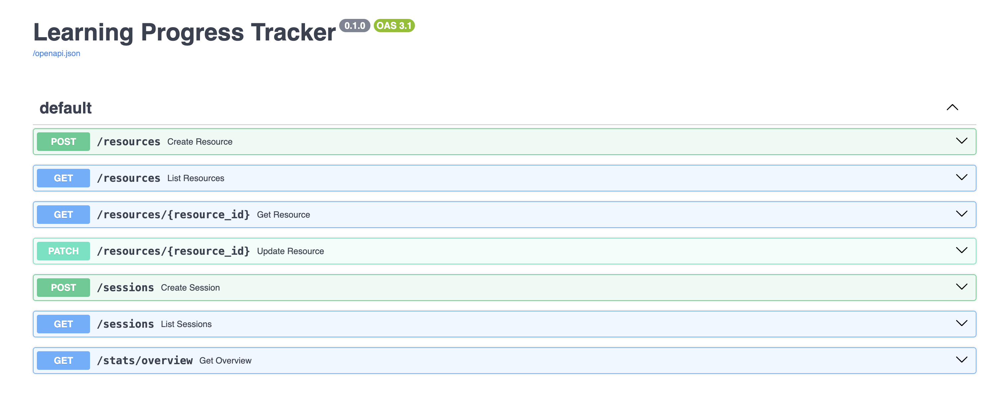
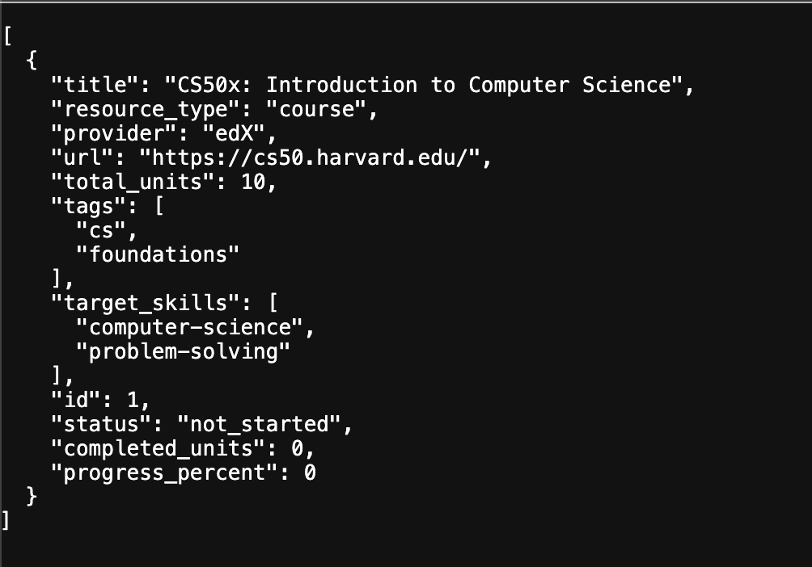

# Learning Progress Tracker

A small **FastAPI** backend to track progress across different learning resources:

- Online courses (Coursera, Udemy, edX, etc.)
- Books and ebooks
- Video series / playlists
- Articles and other “one-off” resources

---



## Features

- ✅ Add learning resources (course, book, video series, article, other)
- ✅ Track status: `not_started`, `in_progress`, `completed`, `abandoned`
- ✅ Track progress via `completed_units` (chapters, lessons, etc.)
- ✅ Log study sessions with start/end time + notes
- ✅ Overview stats:
  - total resources, completed vs in progress
  - total study hours
  - breakdown by resource type
  - breakdown by target skills (with hours per skill)
- ✅ Fully typed Python code (Pydantic models, FastAPI)
- ✅ Basic tests with `pytest` and `fastapi.testclient`

## Storage

The app uses SQLite + SQLModel to persist data in a local database file:

DB URL (default): sqlite:///./data/learning.db

Tables: resources, study_sessions

You can change the DB path in app/database.py if needed.

---

## Tech Stack

- **Language:** Python 3.11+ (or 3.10+)
- **Framework:** [FastAPI](https://fastapi.tiangolo.com/)
- **Data modelling:** Pydantic
- **Server:** Uvicorn
- **Testing:** pytest, FastAPI TestClient

---

## Project structure

```text
learning-progress-tracker/
├─ app/
│  ├─ __init__.py
│  ├─ main.py          # FastAPI entrypoint, routes
│  ├─ schemas.py       # Pydantic models & enums (API layer)
│  ├─ models.py        # SQLModel ORM models (DB layer)
│  ├─ database.py      # Engine, session dependency, create tables
│  └─ services.py      # Business logic (resources, sessions, stats)
├─ tests/
│  ├─ test_resources.py   # HTTP-level tests (FastAPI TestClient)
│  └─ test_services.py    # Service-layer tests (no FastAPI)
├─ requirements.txt
├─ docker-compose.yml
├─ Dockerfile
├─ pytest.ini
├─ mypy.ini
├─ ruff.toml
└─ README.md
```

## Get Started

Clone and create a virtual environment:

```bash
git clone https://github.com/<your-username>/learning-progress-tracker.git
cd learning-progress-tracker

python -m venv .venv
source .venv/bin/activate  # Windows: .venv\Scripts\activate
```

Install dependencies:

```bash
pip install -r requirements.txt
```

Run the app:

```bash
uvicorn app.main:app --reload
```

The API will be available at:

Swagger UI: http://127.0.0.1:8000/docs

ReDoc: http://127.0.0.1:8000/redoc

## Running with Docker

```bash
docker compose build
docker compose up
```

## Code quality

Run tests:

```bash
pytest
```

Type-check with mypy:

```bash
mypy app
```

Lint with Ruff:

```bash
ruff check app tests
```

## Example Usage

```bash
# Create a resource
curl -X POST http://127.0.0.1:8000/resources \
  -H "Content-Type: application/json" \
  -d '{
    "title": "CS50x: Introduction to Computer Science",
    "resource_type": "course",
    "provider": "edX",
    "url": "https://cs50.harvard.edu/",
    "total_units": 10,
    "tags": ["cs", "foundations"],
    "target_skills": ["computer-science", "problem-solving"]
  }'

# Get stats
curl http://127.0.0.1:8000/stats/overview
```


